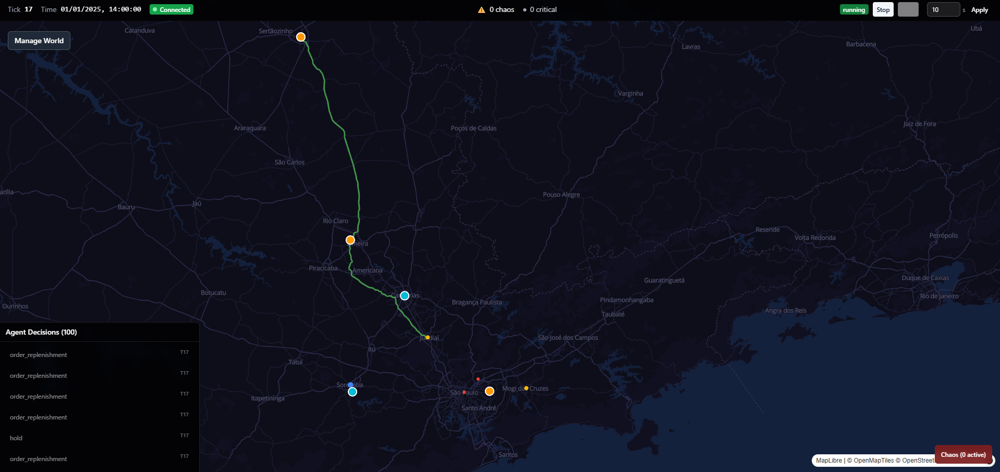
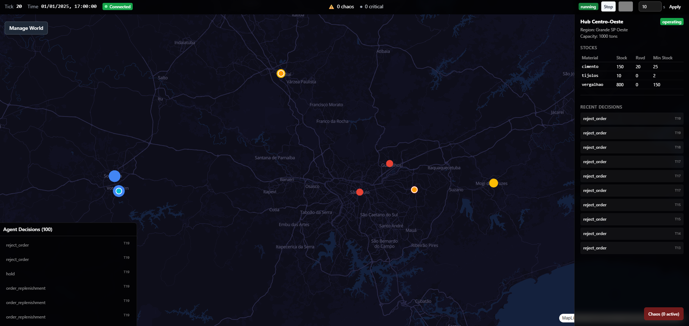
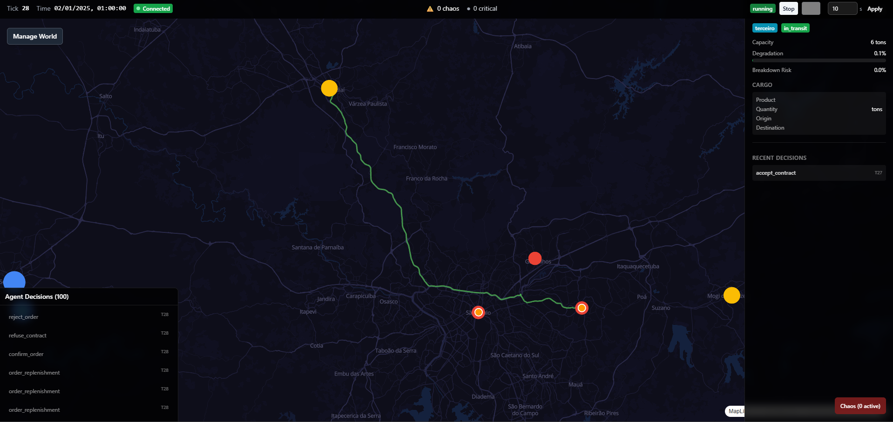
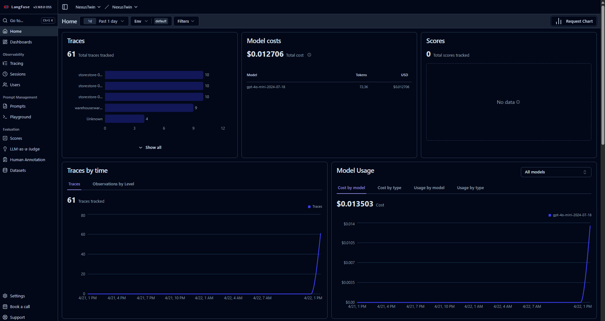
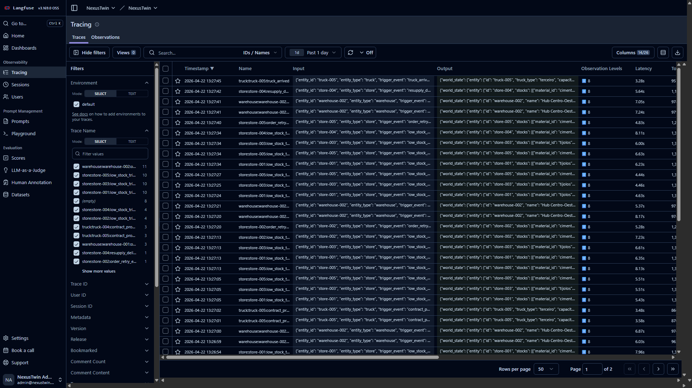

<div align="center">

# 🚚 Nexus Twin

### A fully autonomous supply chain simulation where every entity — factory, warehouse, store, and truck — is an AI agent that perceives the world, makes decisions, and acts without human intervention.

<br />

[](https://www.python.org/)
[](https://fastapi.tiangolo.com/)
[](https://langchain-ai.github.io/langgraph/)
[](https://react.dev/)
[](https://www.typescriptlang.org/)
[](https://postgis.net/)
[](https://deck.gl/)
[](https://langfuse.com/)

<br />


<br />



</div>

---

## ✨ What is Nexus Twin

A closed, autonomous world inspired by RPG NPCs — but instead of a dungeon, the world is a supply chain of construction materials running on the real road network of São Paulo state. Every factory, warehouse, store, and truck is an **AI agent** that reads the world, talks to other agents, and resolves problems on its own. You are the **game master**: you watch the simulation unfold, inject chaos events, reshape the world, and debug agent decisions in real time.

- 🤖 **Autonomous multi-agent system** — each entity runs a LangGraph `StateGraph` (`perceive → decide → act`) powered by `gpt-4o-mini`
- 🗺️ **Real São Paulo road network** — trucks route over OSM highways (Anhanguera, Bandeirantes, Dutra) via self-hosted Valhalla, animated on a WebGL map
- ⏱️ **Tick-based physics engine** — 10s real = 1 simulated hour; deterministic physics + fire-and-forget LLM agents
- 🎲 **Chaos injection** — strikes, road blocks, machine breakdowns, demand spikes; agents adapt autonomously
- 🎮 **Game-master dashboard** — fullscreen WebGL map with inspect panels and live agent decision feed
- 🔎 **Observability built-in** — optional Langfuse integration for tracing, cost, and latency of every agent decision

---

## 📸 Screenshots

<table>
  <tr>
    <td width="50%" valign="top">
      
      <p align="center"><sub><b>Inspect any node.</b> Click a factory, warehouse, or store to see stock per material, min thresholds, and the agent's recent decisions.</sub></p>
    </td>
    <td width="50%" valign="top">
      
      <p align="center"><sub><b>Follow a truck in real time.</b> Cargo, degradation, breakdown risk, and route animate live as the truck drives along actual OSM highways.</sub></p>
    </td>
  </tr>
</table>

---

## 🧱 Tech Stack

| Layer                | Technology                                                      |
| -------------------- | --------------------------------------------------------------- |
| **Backend runtime**  | Python 3.11+, FastAPI, Uvicorn                                  |
| **AI / Agents**      | LangGraph `StateGraph`, OpenAI `gpt-4o-mini`                    |
| **Agent tools**      | LangChain `@tool` + `ToolNode`                                  |
| **Guardrails**       | Pydantic v2 — validates every agent decision before DB write    |
| **Observability**    | Langfuse (self-hosted, optional) — tracing, cost, latency       |
| **Database**         | PostgreSQL 15+ with PostGIS                                     |
| **Async jobs**       | Celery + Redis (non-LLM background tasks)                       |
| **Realtime**         | FastAPI WebSockets + Redis Pub/Sub                              |
| **Frontend**         | React 18 + TypeScript + Vite                                    |
| **Map / WebGL**      | MapLibre GL JS 4 + deck.gl 9 (`TripsLayer`, `ScatterplotLayer`) |
| **Global state**     | Zustand (WorldState synced per tick via WebSocket)              |
| **UI / HUD**         | Tailwind CSS + shadcn/ui                                        |
| **Tile server**      | Martin (Rust) serving PMTiles                                   |
| **Routing engine**   | Valhalla (Docker) — truck-aware routing                         |
| **Tile generation**  | Planetiler → PMTiles (one-time setup)                           |

---

## 🚀 Getting Started

### Prerequisites

- **Docker 24+** and **Docker Compose**
- **Python 3.11+**
- **Node.js 20+**
- **OpenAI API key** with credit (agents use `gpt-4o-mini`, ~$0.15 per 1M input tokens)

### 1. Clone and configure

```bash
git clone <repo-url>
cd nexus-twin
cp backend/.env.example backend/.env
```

Open `backend/.env` and set:

```dotenv
OPENAI_API_KEY=sk-your-key-here
```

All other values default to `localhost` and work out of the box.

### 2. Generate geo data (one-time)

Rendering the map and truck routing need OSM data for São Paulo state. This is a ~1 hour one-time setup (downloads + Planetiler tile build + Valhalla graph build).

→ Full instructions: **[`geo/README.md`](geo/README.md)**

### 3. Start the infrastructure

All services (PostgreSQL + PostGIS, Redis, Martin, Valhalla, and optional Langfuse) are managed by Docker Compose:

```bash
docker compose up -d
```

Check everything is healthy:

```bash
docker compose ps
```

### 4. Apply migrations and seed the world

```bash
cd backend
python -m venv .venv
source .venv/bin/activate
pip install -e ".[dev]"

alembic upgrade head                 # creates tables + PostGIS extensions
python scripts/seed.py               # seeds the default world
```

The default world contains: **3 materials**, **3 factories**, **3 warehouses**, **5 stores**, and **6 trucks** (2 owned by factories + 4 third-party).

### 5. Run backend and frontend

Open two terminals:

**Terminal 1 — Backend**

```bash
cd backend
source .venv/bin/activate
uvicorn src.main:app --reload --port 8000
```

**Terminal 2 — Frontend**

```bash
cd frontend
npm install
npm run dev
```

Open your browser at **<http://localhost:5173>** and press **Start Simulation** in the HUD.

---

## 📊 Observability (optional)

Nexus Twin ships with an opt-in integration to [Langfuse](https://langfuse.com) (self-hosted, OSS) that gives you **one trace per agent decision**: full prompt + response, input/output tokens, estimated cost, latency, model version, and metadata (`agent_type`, `entity_id`, `trigger_event`, `tick`). Decisions for the same order share a `session_id`, so the full path (store → warehouse → truck pickup → truck delivery) reads as one timeline in the dashboard.

Without the Langfuse env vars set, the system runs with **zero overhead and zero network calls** — the instrumentation simply does not load.

<table>
  <tr>
    <td width="50%" valign="top">
      
      <p align="center"><sub><b>Aggregated view.</b> Total cost per model, tokens consumed, and traces grouped by <code>agent_type:entity_id</code> — at a glance you see which agents are most active and how much they cost.</sub></p>
    </td>
    <td width="50%" valign="top">
      
      <p align="center"><sub><b>Per-decision tracing.</b> Every agent cycle is a row: timestamp, trigger event, full input context, LLM output, latency, and token usage — filterable by <code>agent_type</code>, <code>trigger_event</code>, or <code>tick</code>.</sub></p>
    </td>
  </tr>
</table>

#### Enabling it

1. Bring up the stack with `docker compose up -d` and wait **~30–60s** on the first boot — ClickHouse runs migrations before `langfuse-web` becomes ready. Check status with `docker compose ps | grep langfuse`.
2. Open the Langfuse dashboard at **<http://localhost:3100>**
3. Sign up — the first user becomes the local admin (credentials stay on your machine)
4. Open the pre-created `NexusTwin` organization and project
5. Go to **Settings → API Keys** and click **Create new API keys**
   > ⚠️ The `secret_key` is shown **only once** — copy both before closing the dialog
6. Paste into `backend/.env`:

```dotenv
LANGFUSE_PUBLIC_KEY=pk-lf-...
LANGFUSE_SECRET_KEY=sk-lf-...
LANGFUSE_HOST=http://localhost:3100
```

7. Restart the backend (`Ctrl+C` on uvicorn, then `uvicorn src.main:app --reload --port 8000`) — every agent decision from the next tick on will appear in the dashboard

> Want to run **only** the observability stack? `docker compose up -d langfuse-web langfuse-worker langfuse-postgres langfuse-clickhouse langfuse-redis langfuse-minio`
>
> To stop just the observability stack: `docker compose stop langfuse-web langfuse-worker langfuse-postgres langfuse-clickhouse langfuse-redis langfuse-minio`

#### What to look at in the dashboard

| View            | What you see                                                                                              |
| --------------- | --------------------------------------------------------------------------------------------------------- |
| **Traces**      | One trace per agent decision — full prompt + response, tokens, cost, latency. Filter by `agent_type`, `trigger_event`, `tick` |
| **Sessions**    | Traces grouped by `order_id` — follow a single order from pickup to delivery across multiple agents       |
| **Generations** | Raw LLM calls with prompt/response pairs, token usage, model version                                      |
| **Dashboards**  | Aggregated metrics over time — tokens consumed, estimated cost, latency p50/p95                           |

#### Troubleshooting

If nothing shows up after starting the simulation, check in this order:

1. **Did you restart the backend after setting the keys?** Langfuse instrumentation is initialized at startup — reloads via `--reload` do pick up `.env` changes, but a full restart is safer.
2. **Is the simulation actually running?** Click **Start Simulation** in the HUD and check the backend logs — you should see `POST https://api.openai.com/v1/chat/completions` lines as agents decide.
3. **Are fast-path `hold` decisions being filtered out in your view?** They show up in the dashboard with metadata `fast_path_taken=true` but may be hidden if you're filtering by `trigger_event`.
4. **Is `langfuse-worker` up?** Without the worker, events queue up in Redis but never reach ClickHouse. `docker compose logs -f langfuse-worker` will tell you.

---

## 📂 Per-module docs

Each part of the project has its own README with deeper detail.

| Module    | What is in there                                                          | Link                                       |
| --------- | ------------------------------------------------------------------------- | ------------------------------------------ |
| 🐍 **Backend**  | Multi-agent architecture, physics engine, repositories, guardrails, tests | **[`backend/README.md`](backend/README.md)** |
| 🎨 **Frontend** | deck.gl layers, HUD, WebSocket sync, worldStore, build                    | **[`frontend/README.md`](frontend/README.md)** |
| 🌍 **Geo data** | OSM download, Planetiler PMTiles, Valhalla routing graph build            | **[`geo/README.md`](geo/README.md)**       |

---

## 🔌 Service Ports

| Service                    | Port  | Purpose                        |
| -------------------------- | ----- | ------------------------------ |
| Frontend (Vite)            | 5173  | Dashboard (HMR dev server)     |
| Backend (FastAPI)          | 8000  | REST API + WebSocket           |
| PostgreSQL + PostGIS       | 5432  | World state persistence        |
| Redis                      | 6379  | Pub/Sub + Celery broker        |
| Martin (tile server)       | 3001  | Vector tiles for MapLibre      |
| Valhalla (routing)         | 8002  | Real truck routes over OSM     |
| Langfuse dashboard         | 3100  | Optional agent observability   |

---

## 🧪 Testing

```bash
cd backend
pip install -e ".[test]"
pytest                               # 839 tests total
pytest tests/unit/                   # 637 unit tests (fast, mocked LLM)
pytest tests/integration/            # 202 integration tests (ephemeral Postgres)
```

Integration tests use `testcontainers` to spin up an ephemeral PostgreSQL — no external database needed.

---

## 📄 License

[MIT](LICENSE)
